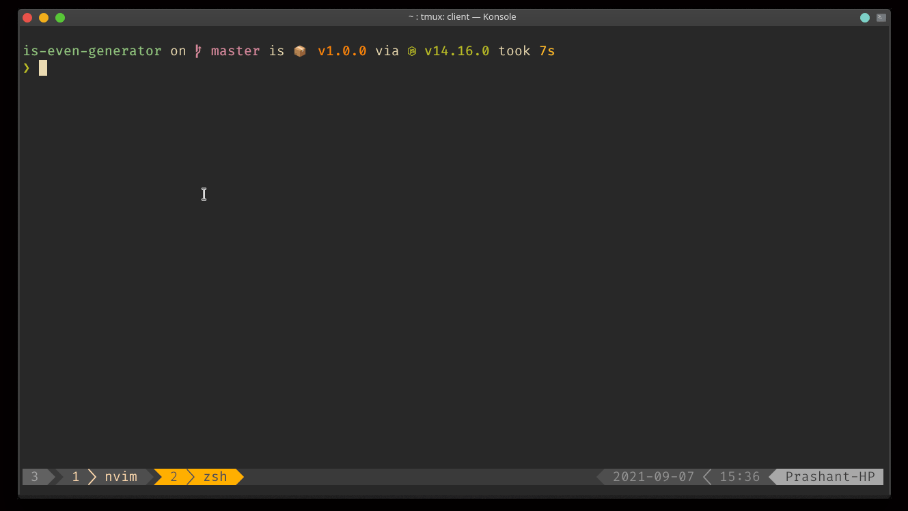

# is-even-generator

A utility to generate optimized production ready function that checks if a number is even.

Works everywhere.

### Demo


### Instruction
```sh
# to generate the function
# By default the <no of items> is 1000
node is-even-generator <no of items>

# example
node is-even-generator 100000
```

use the function in your code
```js
const isEven = require('./script');

isEven(1000) // returns true
```

